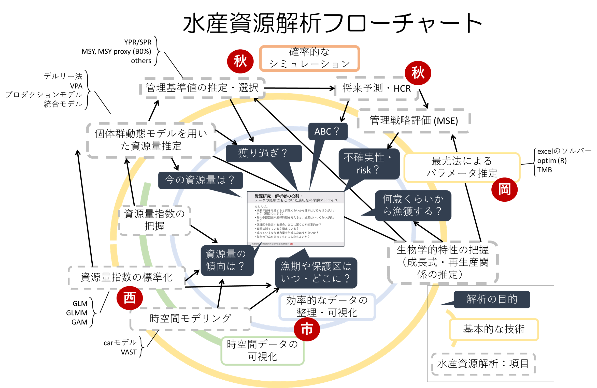

## 1. 水産資源データの解析 (市野川,12月26日 13:30～15:10)

プレゼンファイル：https://github.com/ichimomo/Shigen-kensyu-2018/blob/master/1-ichinokawa/1-ichinokawa.pdf

- 資源管理の目的と科学者の役割
- 水産資源解析フローチャート
   

- Rと水産資源解析
   - スライドで示したRコードはこちら https://github.com/ichimomo/Shigen-kensyu-2018/blob/master/1-ichinokawa/kensyu_ichinokawa.md
   - pdf版もあります　https://github.com/ichimomo/Shigen-kensyu-2018/blob/master/1-ichinokawa/kensyu_ichinokawa.pdf

