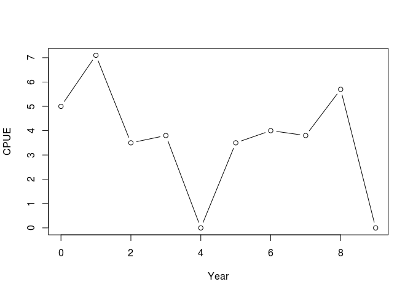
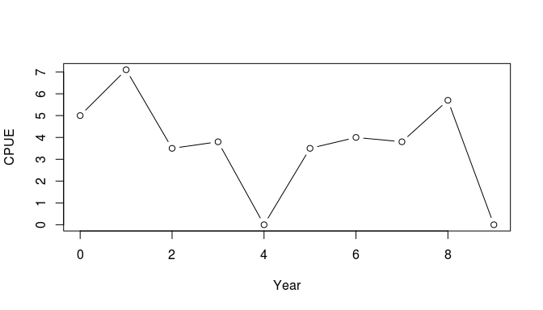
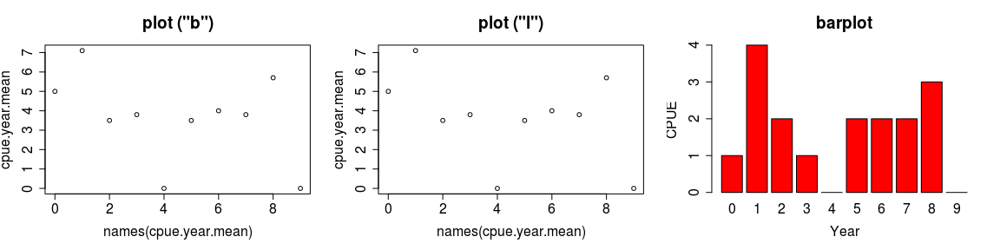
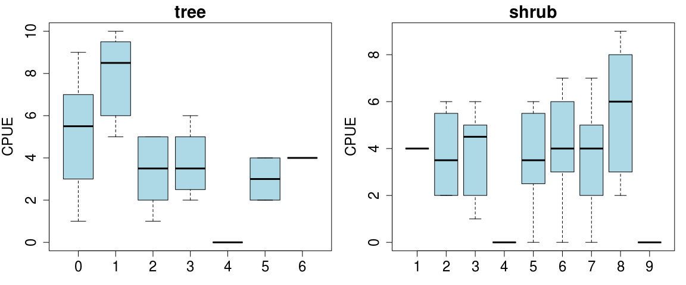
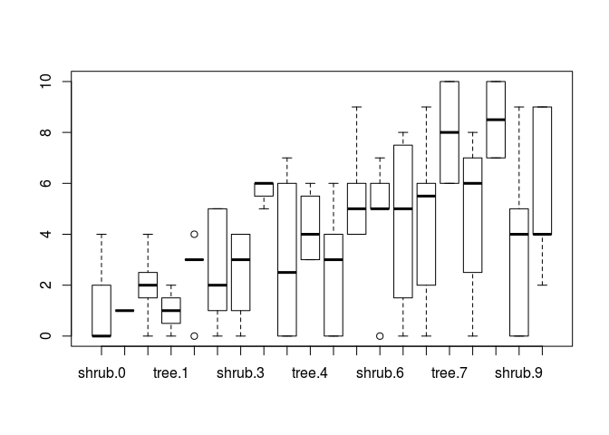
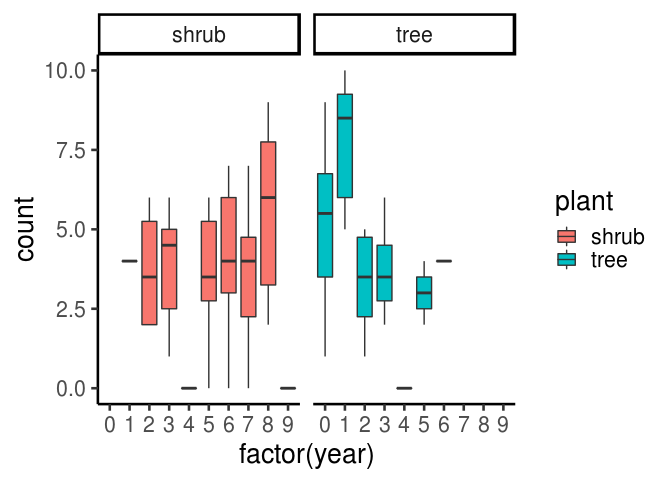

<!-- page_number: true -->
---

実例: Rを使ったデータの整理・可視化
===================================

事前準備
--------

-   Rを立ち上げ、「ファイル」→「ディレクトリの変更」で、コピーした研修用のフォルダ「1-ichinokawa」を選ぶ
-   それにより「作業ディレクトリ」が「1-ichinokawa」に移動し、ここからデータファイルやRのコードのファイルにアクセスできるようになります

---

データの読み込み
----------------

-   2-okamuraフォルダ内にある dat1.csv を読み込んでみましょう
-   Rの基本構造：　関数(引数=設定, 引数=設定)
-   データをRから読む関数は、read.csv(ファイル) です。

<!-- -->

    # '../'は一個上のフォルダ、という意味です
    # read.csvで読んだデータをcpue.dataという'オブジェクト'に入れます
    cpue.data <- read.csv("../2-okamura/dat1.csv")

---

データの中身の確認
------------------

    # オブジェクトの先頭の数行だけを出力する関数：head（オブジェクト名）
    head(cpue.data)

      count year site plant
    1     1    0    0  tree
    2     1    0    1  tree
    3     5    0    2  tree
    4     6    0    3  tree
    5     3    0    4  tree
    6     5    0    5  tree

    # どのくらいの大きさの行列か？：dim(オブジェクト名)
    dim(cpue.data)

    [1] 100   4

---

データの表示
------------

    cpue.data[, 1]  # 一列目のデータだけを表示する

     [1]  1  1  5  6  3  5  7  6  7  9  4  4  5  6  6  9  8 10 10  9  2  2  1
    [24]  5  5  4  3  5  6  2  2  1  2  4  3  6  5  6  5  4  0  0  0  0  0  0
    [47]  0  0  0  0  0  2  3  2  3  4  5  6  6  4  0  2  4  3  6  3  5  6  7
    [70]  4  0  2  3  4  2
     [ reached getOption("max.print") -- omitted 25 entries ]

    cpue.data[1, 1]  # １行・１列目のデータだけを表示する

    [1] 1

    cpue.data$count  # '$' + 列の名前という指定のしかたもできます

     [1]  1  1  5  6  3  5  7  6  7  9  4  4  5  6  6  9  8 10 10  9  2  2  1
    [24]  5  5  4  3  5  6  2  2  1  2  4  3  6  5  6  5  4  0  0  0  0  0  0
    [47]  0  0  0  0  0  2  3  2  3  4  5  6  6  4  0  2  4  3  6  3  5  6  7
    [70]  4  0  2  3  4  2
     [ reached getOption("max.print") -- omitted 25 entries ]

---

値の代入
--------

-   "オブジェクト名" &lt;- "別のオブジェクト"
-   数字や文字などを入れておく「箱」のようなものをRでは「オブジェクト」と呼びます。

<!-- -->

    cpue1.1 <- cpue.data[1, 1]  # CPUEデータの一列目のデータをcpue1.1というオブジェクトに代入する
    cpue1.1

    [1] 1

    cpue.N <- cpue.data$count  # CPUEデータのN(尾数)データに別の名前をつける
    cpue.N

     [1]  1  1  5  6  3  5  7  6  7  9  4  4  5  6  6  9  8 10 10  9  2  2  1
    [24]  5  5  4  3  5  6  2  2  1  2  4  3  6  5  6  5  4  0  0  0  0  0  0
    [47]  0  0  0  0  0  2  3  2  3  4  5  6  6  4  0  2  4  3  6  3  5  6  7
    [70]  4  0  2  3  4  2
     [ reached getOption("max.print") -- omitted 25 entries ]

---

年で集計する
------------

-   excelのピボットテーブル的な機能に対応します
-   tapply(集計する列, 注目する列, 関数) といったかたちで使います

<!-- -->

    cpue.year.mean <- tapply(cpue.data$count, cpue.data$year, mean)
    cpue.year.mean

      0   1   2   3   4   5   6   7   8   9 
    5.0 7.1 3.5 3.8 0.0 3.5 4.0 3.8 5.7 0.0 

---

データを抽出する
----------------

-   subset(対象とするデータ, 条件)

<!-- -->

    cpue.site1 <- subset(cpue.data, site == 1)
    cpue.site2 <- subset(cpue.data, site == 2)
    cpue.year.mean.site1 <- tapply(cpue.site1$count, cpue.site1$year, mean)
    cpue.year.mean.site2 <- tapply(cpue.site2$count, cpue.site2$year, mean)

---

データをプロットする
--------------------

    # ylim=y軸の範囲, type=どんなやりかたでプロットするか（'b':線と点、'l':
    # 線のみ、'p': 点のみ）
    plot(names(cpue.year.mean), cpue.year.mean, xlab = "Year", ylab = "CPUE", ylim = c(0, 
        max(cpue.year.mean)), type = "b", col = 1)

---

複数のグラフを並べる1
---------------------

-   par : グラフのいろいろな設定をする関数です
-   par(mfrow=c(1,3)) \# 1x3列で図を並べる
-   par(ps=18) \# フォントの大きさを決める

---

複数のグラフを並べる2
---------------------

    par(mfrow = c(1, 3), ps = 18, bg = "wheat")
    plot(names(cpue.year.mean), cpue.year.mean, xlab = "Year", ylab = "CPUE", ylim = c(0, 
        max(cpue.year.mean)), type = "b", col = 1)
    title("plot (\"b\")")

    plot(names(cpue.year.mean), cpue.year.mean, xlab = "Year", ylab = "CPUE", ylim = c(0, 
        max(cpue.year.mean)), type = "l", col = 1)
    title("plot (\"l\")")

    barplot(cpue.year.mean.site1, xlab = "Year", ylab = "CPUE", col = 2)
    title("barplot")

---

繰り返し処理1
-------------

-   たとえばplant/shrubごとに年のトレンドを比較するには？？

<!-- -->

    # treeのデータだけをとりだす
    cpue.tree <- subset(cpue.data, plant == "tree")
    # cpue.treeについて、年のトレンドを見る
    boxplot(cpue.tree$count ~ cpue.tree$year, ylab = "CPUE", col = c("lightblue"))

---

繰り返し処理2
-------------

-   これを2回繰り返せば良い

<!-- -->

    par(mfrow = c(1, 2), mar = c(3, 4.3, 2, 1), ps = 18)
    # treeのデータだけをとりだす
    cpue.tree <- subset(cpue.data, plant == "tree")
    boxplot(cpue.tree$count ~ cpue.tree$year, ylab = "CPUE", col = c("lightblue"))
    title("tree")

    # こんどはshurbのデータだけをとりだす
    cpue.shrub <- subset(cpue.data, plant == "shrub")
    boxplot(cpue.shrub$count ~ cpue.shrub$year, ylab = "CPUE", col = c("lightblue"))
    title("shrub")

---

-   結果のプロット
    

---

繰り返し処理3
-------------

-   forループを使うと？ =&gt; 複数の図を10枚でも100枚でも一気にかけます

<!-- -->

    par(mfrow = c(1, 2), mar = c(3, 4.3, 2, 1), ps = 18)
    type <- c("tree", "shrub")
    for (i in 1:2) {
        # iを1から2まで順番に変える
        cpue.site <- subset(cpue.data, plant == type[i])
        boxplot(cpue.site$count ~ cpue.site$year, ylab = "CPUE", col = c("lightblue"))
        title(type[i])
    }

---

別のやり方1
===========

-   1行でそれっぽいのも書けますが、、

<!-- -->

    par(mfrow = c(1, 1))
    boxplot(count ~ plant + site, data = cpue.data)

---

別のやり方2: ggplot2の利用
==========================

-   ggplot2：きれいなグラフを簡単に書くためのパッケージ

<!-- -->

    library(ggplot2)
    ggplot(data = cpue.data, aes(x = factor(year), y = count, fill = plant)) + geom_boxplot() + 
        facet_grid(~. + plant) + theme_classic(base_size = 20, base_family = "Helvetica")

---

ggplot2の利点
-------------

-   何も言わなくてもいい感じの「色」を使ってくれる
-   様々な「テーマ(theme)」を選ぶことで最初から整形された図を作る
-   複雑なデータ構造（複数のグラフのプロット）の図を作れる

---
