# 管理基準値と資源管理 (秋田, 12月27日 13:30～15:00)

- 管理基準値とは？
- Kobe plot
- いろいろな管理基準値（YPR, SPR, ...）
- Harvest Control Rule

## 講習はパワーポイントのスライドを用いて、数式やコードを使わずに発表予定です。
## app_future.Rなどのコードを実行することで利用できるようになるRshinyアプリを用います。
## RshinyはRstudioを使っている方は、そのまま利用できると思います（Rstudioでapp_future.Rを開いて、エディターの右上にある"Run App"と書かれたボタンを押してみてください）。
## Rstudioを利用していない方は、shinyパッケージのダウンロードが必要です（webに接続した状態で、app_future.Rを実行していただければ自動でダウンロードすると思います）。周知が遅くなってしまい大変申し訳ありません。
--------------------------------------------------------------------------

## 0. データのセット
-----------------

齢構成がある種を対象として、簡単な漁業制御ルールをコンピューター上で再現することを目指す。以下のような状況を順に考えよう。

1.  漁業がない状況
2.  漁業が開始され資源が減少する過程
3.  管理基準値に基づいた資源管理が実施される過程

例えば、下記のような資源を考えよう。

    options(digits=4) # 出力を見やすくするため
    age <- 10 # 最大年齢クラス（この場合０〜９歳）
    maturity_age <- 5 # 成熟年齢
    M_at_age <- rep(0.3,age) # 自然死亡率は齢に依らず一定と仮定 
    Q_at_age <- c(rep(0,maturity_age),rep(1,age-maturity_age)) # 成熟年齢に達すると100%成熟すると仮定 

なお、性別については区別しない。重量については以下のようにvon-Bertalanffy式
$$
W(a)=w\_{\\infty} ( 1-{\\rm exp}\[-K(a-a\_0)\] )^b
$$
 を仮定した。今回は詳細には立ち入らない。

    # パラメータ
    VB_a0 <- -0.1
    VB_b <- 3
    VB_K <- 0.5
    VB_winf <- 10

    VB <- function(a){
      VB_winf*(1 - exp(-VB_K*(a-VB_a0)) )^VB_b 
    }

    W_at_age <- sapply(seq(0,age-1,1),VB)
    plot(seq(0,(age-1),1),W_at_age,xlab = "age",ylab = "weight (kg)",main = "weight at age",type = "b")

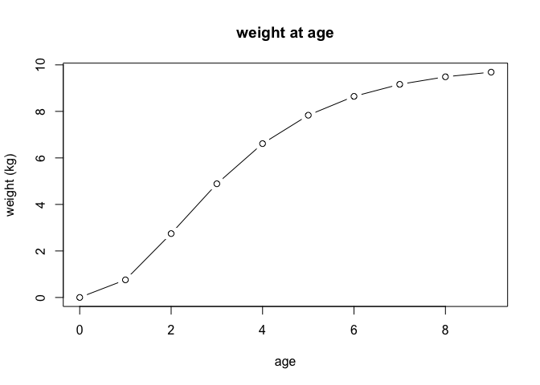

再生産関係についてはBeverton Holt式
$$
R=\\frac{a SSB}{b + SSB}
$$
 を採用した。以下、加入個体数を*R*、産卵親魚重量を*S**S**B*(Spwainig
Stock Biomass)と記載することがある。

    # パラメータ
    BH_a <- 1
    BH_b <- 1

    BH <- function(SSB,BH_a,BH_b){
      R <- BH_a * SSB / (BH_b + SSB)
      return(R)
    }
    curve(BH(x,BH_a,BH_b),from = 0,to = 10,xlab = "SSB (weight)",ylab = "Recruitment (number)",main="S-R relationship")

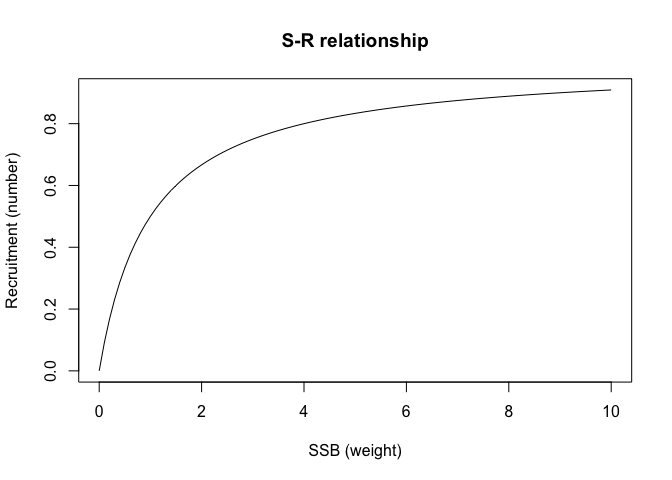

再生産関係をシミュレーションで再現する際に採用されたパラメータ(*a*,*b*)の値は、管理基準値を計算する時に推定するが、今回は詳細には立ち入らない。また、単位（重量・尾数）は後から設定できるので、深く考えないで進める。

## 1. 漁業がない状況
-----------------

0歳個体が5（単位）個体存在する状況を初期状態として10年後を見ることで、漁業がない状況における個体群動態を再現してみよう。理解のために、まずは環境変動はないと仮定する。

    burn_in <- 10 # 計算年数
    SSB_init <- 5 # 初期加入個体
    SSB <- c(SSB_init,rep(0,burn_in))
    N_at_age <- rep(0,age)
    for (y in 1:burn_in) {
      for (a in 1:age){
        if(a==1) {
          N_at_age[a] <- BH(SSB[y],BH_a,BH_b)  
        }else{
          N_at_age[a] <- N_at_age[a-1] * exp(-M_at_age[a-1]) # exp[-M]は年生存率
        }
      }
      SSB[y+1] <- sum(N_at_age*Q_at_age*W_at_age)
    }
    print(SSB)

    ##  [1] 5.000 4.843 4.816 4.812 4.811 4.811 4.811 4.811 4.811 4.811 4.811

    plot(1:burn_in,SSB[1:burn_in],type = "b",xlab = "year",ylab = "SSB",main = "without fishing")

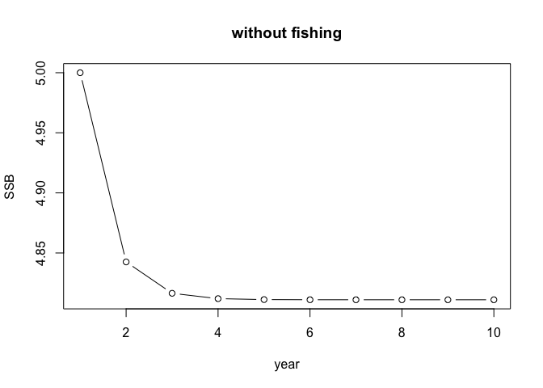

漁業がない場合、SSB=4.811が釣り合った（平衡）状態となる。平衡状態では、以下の2式
$$
R=\\frac{a SSB}{b + SSB}
$$
*S**S**B* = *S**P**R*|*F* = 0*R*

を満たす(*S**S**B*,*R*)の組み合わせが選ばれる。*S**P**R*|*F* = 0は、漁業がない場合の「加入あたりの産卵親魚量」に対応する。

    S_at_age <- c(1,rep(0,age-1))
    for (a in 1:(age-1)){
      S_at_age[a+1] <- S_at_age[a] *exp(-M_at_age[a])
    }
    print(S_at_age) # 加入個体のx年後までの生存率(x=1~9)

    ##  [1] 1.00000 0.74082 0.54881 0.40657 0.30119 0.22313 0.16530 0.12246
    ##  [9] 0.09072 0.06721

    SPR0 <- sum(S_at_age * W_at_age * Q_at_age)
    print(SPR0) # 加入1個体の産卵親魚量(kg)への貢献量

    ## [1] 5.811

    curve(expr =  BH_a * x / (BH_b + x),from = 0,to=6,xlab = "SSB",ylab = "R",main="equilibrium point")
    curve(expr = x/SPR0,add = T)

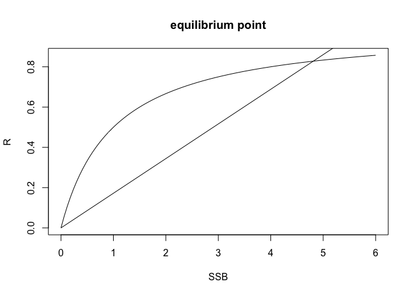

2つの関係式を図示してみると上のようになり、交点が平衡点に相当する。

## 2. 漁業が開始され資源が減少する過程
-----------------------------------

次に、漁獲係数F=0の強さで、漁業の操業を続ける状況を再現しよう。簡単のために、漁獲死亡係数は齢に依らず一定と仮定する。前にシミュレートした、漁業がない場合の最終年を初期状態として、50年間漁業を続ける場合を考える。今回は、不確実性（再生産関係と漁業）も含めてシミュレートする。その際、加入個体数や漁獲量に乗じる誤差項については、0以上の値をとり、平均1になるような対数正規乱数を選んだ。

    SSB_init2 <- SSB[y+1] # 漁業がない状態を初期状態とする
    F_at_age <- rep(0.25,age) # 漁獲死亡係数は齢に依らず一定と仮定
    term <- 50 # 操業期間
    sd <- 0.3 # 加入の変動係数
    sd2 <- 0.1 # 漁獲の変動係数
    SSB2 <- c(SSB_init2,rep(0,term))
    Catch <- rep(0,term)
    N_at_age_mat <- F_tmp0 <- matrix(0,nrow = term+1,ncol=age)
    N_at_age_mat[1,] <- N_at_age
    for (y in 1:term) {
      F_tmp0[y,] <- F_at_age * exp(rnorm(1,mean = 0,sd = sd2)-sd2^2/2)# 誤差の影響を含むので、毎年更新される
      Catch[y] <- sum(
        F_tmp0[y,]/(F_tmp0[y,]+M_at_age)*(1-exp(-F_tmp0[y,]-M_at_age))*N_at_age_mat[y,]*W_at_age
      )
      for (a in 1:age){
        if(a==1) {
          N_at_age_mat[y+1,a] <- BH(SSB2[y],BH_a,BH_b)* exp(rnorm(1,mean = 0,sd = sd)-sd^2/2)
        }else{
          N_at_age_mat[y+1,a] <- N_at_age_mat[y,a-1] * exp(-M_at_age[a-1]-F_tmp0[y,a-1]) # exp[-M-F]は年生存率
        }
      }
      SSB2[y+1] <- sum(N_at_age_mat[y+1,]*Q_at_age*W_at_age)
    }
    print(SSB2)

    ##  [1] 4.8111 3.7453 2.9531 2.2928 1.8614 1.4491 1.1438 1.1002 1.2879 1.0637
    ## [11] 0.8722 0.6820 0.6252 0.5195 0.6005 0.6070 0.5245 0.5544 0.3863 0.3791
    ## [21] 0.3412 0.3910 0.4137 0.4738 0.3781 0.3553 0.2837 0.2825 0.2921 0.2715
    ## [31] 0.2575 0.2777 0.2388 0.1948 0.2476 0.2418 0.2258 0.2477 0.2523 0.2518
    ## [41] 0.2446 0.2433 0.2183 0.2594 0.2405 0.2214 0.2375 0.2252 0.2544 0.2375
    ## [51] 0.2176

    par(mfrow=c(1,2))
    plot(1:term,SSB2[1:term],type = "l",xlab = "year",ylab = "SSB",main = "SSB")
    plot(1:term,Catch,type = "l",xlab = "year",ylab = "catch",main = "catch")

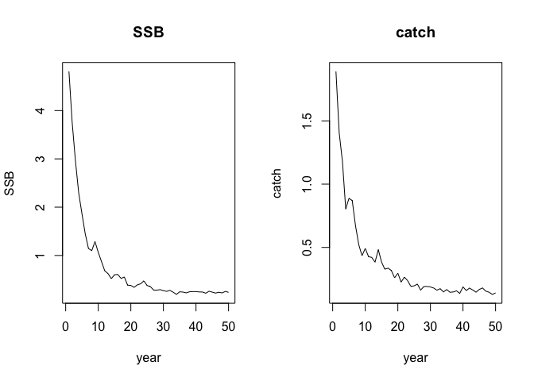

この漁獲死亡係数の下では、50年間で産卵親魚量が大きく減少することがわかる。同時に、漁獲量も開発初期から徐々に減少していく。SPRについても計算してみよう。

    S_at_age <- c(1,rep(0,age-1))
    for (a in 1:(age-1)){
      S_at_age[a+1] <- S_at_age[a] * exp(-M_at_age[a]-F_at_age[a])
    }
    SPR1 <- sum(S_at_age * W_at_age * Q_at_age)
    print(SPR1) # なお、a*SPR1 - b < 0で絶滅する

    ## [1] 1.2

    print(SPR1/SPR0) # %SPR（漁業がない状態のSPRで割ったSPR）

    ## [1] 0.2065

%SPRは約21%と計算されるが、これは漁業がない状態を100%と考え、20%の産卵親魚量をとり残すような状況であることを示唆している。SPRが計算されたことから、（確率的変動がない場合の）平衡状態の(*S**S**B*,*R*)も計算できる。

    curve(expr =  BH_a * x / (BH_b + x),from = 0,to=6,xlab = "SSB",ylab = "R")
    curve(expr = x/SPR0,add = T)
    curve(expr = x/SPR1,add = T)
    SSB_eq <- BH_a * SPR1 - BH_b # SSBとRに関する連立方程式を解くと出てくる
    points(x = SSB_eq, y=BH(SSB_eq,BH_a,BH_b))

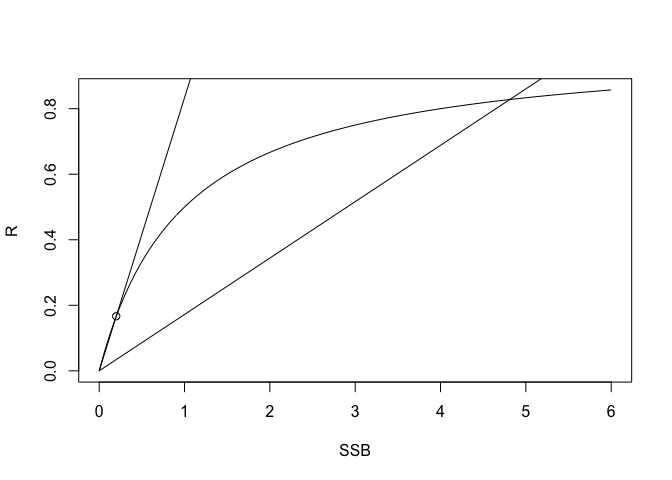

交点はSSB=0よりも少し大きい所に存在する。さて、本来であれば漁獲量データやCPUE指標値などから標資源量の推定をすることで、産卵親魚量や加入量が推定されるのだが、今回はこれら50年分の値は既知としよう。これら50個の(*S**S**B*,*R*)の組み合わせから再生産関係を推定してみる。今回は資源評価で利用されているコード"rvpa1.9.2.r"と"future2.1.r"をソースとして読み込んで、最尤推定を実施する。

    source("rvpa1.9.2.r")
    source("future2.1.r")
    SRdata <- get.SRdata(R.dat = N_at_age_mat[2:(term+1),1], SSB.dat = SSB2[1:term] )
    BH.par0 <- fit.SR(SRdata, SR = "BH", method = "L2", AR = 0, hessian = FALSE)
    plot.SRdata(SRdata)
    print(BH.par0$pars) # 推定結果(BH_a, BH_b, sd, 自己相関の強さ（今回は用いてない）)

    ##        a      b     sd rho
    ## 1 0.8671 0.9253 0.2621   0

    points(BH.par0$pred$SSB, BH.par0$pred$R, col = 3, type = "l", lwd = 3)

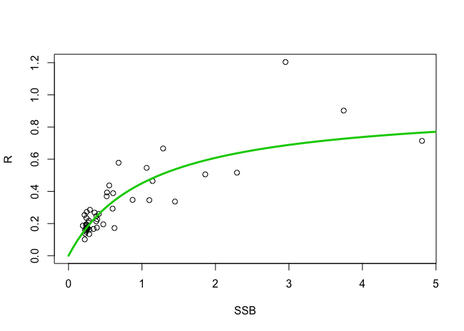

確率的挙動を含むことから、プロットされた値は理論カーブから大きくズレる。

## 3. 管理基準値に基づいた資源管理が実施される過程
-----------------------------------------------

これまで設定されていた漁獲強度は、未開発時の21%を取り残す程度の漁獲圧であった。水産資源解析の研究によると、30%~40%を取り残すのが良いとされている。そこで未開発時の30%を取り残すには、現状の漁獲圧からどれだけ減らさなくてはならないかを考えよう。

    target_SPR <- 0.3
    f_mulitplier <- seq(0,1.5,0.01)
    f_len <- length(f_mulitplier)
    SPR_res <- rep(0,f_len)
    for (i in 1:f_len){
      
      S_at_age <- c(1,rep(0,age-1))
      for (a in 1:(age-1)){
        S_at_age[a+1] <- S_at_age[a] * exp(-M_at_age[a]- f_mulitplier[i] * F_at_age[a])
      }
      SPR_res[i] <- sum(S_at_age * W_at_age * Q_at_age)/SPR0
    }
    min_tmp <- min(abs(SPR_res-target_SPR))
    limit_f <- f_mulitplier[which(abs(SPR_res-target_SPR)==min_tmp)]
    plot(f_mulitplier,SPR_res,xlab = "F_multiplier",ylab = "%SPR",main = "%SPR",type = "l")
    points(x = limit_f,y=target_SPR)

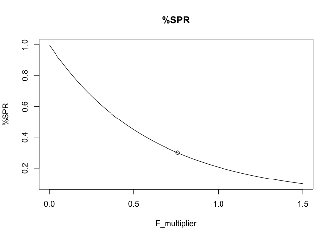

    print(1-limit_f) # %30SPRを実現するために、現状の漁獲圧に対して減らさなくてはならない漁獲強度

    ## [1] 0.24

現状より約24%程の漁獲圧の減少によって、%SPR=30%を達成できることがわかった。これら一連の議論は、現状の漁業と同一の選択率を仮定している点に注意。F\_multiplierは、同一の選択率の強弱を決めるスカラー値である。F\_multiplier=1の時は、現状の漁獲係数を意味している（%SPR=21%）。

今回は、再生産関係の推定を必要としない漁獲制御ルールを採用する。制御ルールを定めるには、望ましい漁業状態と資源状態の両者を決める必要があった。前者については、%SPR=30%を達成するような漁獲圧としよう。後者については、SSB-Rプロットから推測される最大加入量の半分を実現するような産卵親魚量としよう。前者をFlimit、後者をBlimitと呼ぶことにする。

    F_limit_at_age <- limit_f*F_at_age
    print(F_limit_at_age)

    ##  [1] 0.19 0.19 0.19 0.19 0.19 0.19 0.19 0.19 0.19 0.19

    R0_est <- BH.par0$pars$a - BH.par0$pars$b/SPR0
    B_limit <- BH.par0$pars$b * R0_est/2 / (BH.par0$pars$a - R0_est/2) 
    print(B_limit)

    ## [1] 0.6382

今回は、推定された再生産関係を用いて、望ましい資源状態を計算しているが、実際はSSB-Rプロットから目視で決めたりすることも多い。

    plot(NULL,xlim = c(0,2*B_limit),ylim = c(0,1.5),xlab = "SSB",ylab = "F/F_limit")
    curve(x/B_limit,from = 0,to = B_limit,add = T)
    curve(x*0+1,from = B_limit,to = 2*B_limit,add = T)

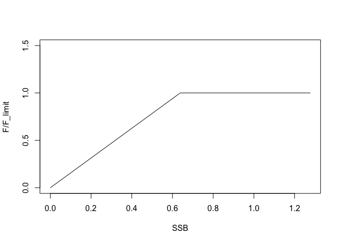

制御ルールは、上の関数に示したように決めよう。すなわち、

1.  産卵親魚量がBlimitを上回る時：漁獲圧=Flimitを維持する
2.  産卵親魚量がBlimitを下回る時：産卵親魚量に応じて漁獲圧をFlimitより減らす

と定める。それでは、このルールに基づいた30年間の管理結果を見てみよう

    SSB_init3 <- SSB2[y+1]
    term_management <- 30 
    N_at_age_mat_new <- F_tmp <- matrix(0,nrow = term_management+1,ncol=age)
    N_at_age_mat_new[1,] <- N_at_age_mat[term+1,]
    SSB3 <- c(SSB_init3,rep(0,term_management))
    Catch2 <- rep(0,term_management)
    #sd2 <- 0.1
    for(y in 1:term_management){
      if(SSB3[y] < B_limit) {
        F_tmp[y,] <- F_limit_at_age * SSB3[y] / B_limit * exp(rnorm(1,mean = 0,sd = sd2)-sd2^2/2)
      }else {
        F_tmp[y,] <- F_limit_at_age * exp(rnorm(1,mean = 0,sd = sd2)-sd2^2/2)
      }
      
      Catch2[y] <- sum(
        F_tmp[y,]/(F_tmp[y]+M_at_age)*(1-exp(-F_tmp[y]-M_at_age))*N_at_age_mat_new[y,]*W_at_age
      )
      
      for (a in 1:age){
        if(a==1) {
          N_at_age_mat_new[y+1,a] <- BH(SSB3[y],BH_a,BH_b)* exp(rnorm(1,mean = 0,sd = sd)-sd^2/2)
        }else{
          N_at_age_mat_new[y+1,a] <- N_at_age_mat_new[y,a-1] * exp(-M_at_age[a-1]-F_tmp[y,a-1])
        }
      }
      SSB3[y+1] <- sum(N_at_age_mat_new[y+1,]*Q_at_age*W_at_age)
    }
    par(mfrow=c(1,2))
    plot(1:(term + term_management),c(SSB2[1:term],SSB3[1:term_management]),type = "l",xlab = "year",ylab = "SSB",main = "SSB_under_management")
    abline(v=term+1,lty=2)
    abline(h=B_limit,col="red")
    plot(1:(term + term_management),c(Catch[1:term],Catch2[1:term_management]),type = "l",xlab = "year",ylab = "catch",main = "catch_under_management")
    abline(v=term+1,lty=2)

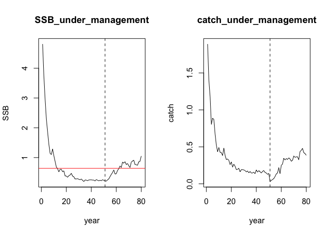

上の図の点線が管理開始年、赤色の水平線がBlimitである。管理を導入するに伴い、

1.  漁獲量の短期的な減少
2.  産卵親魚量の回復
3.  漁獲量の回復

という順番に漁業状態および資源状態が変化することがわかる。管理指標値(Flimit,
Blimit)や、様々なパラメータを変化させることで、

-   短期的な漁獲量と資源回復スピードはトレードオフの関係にある
-   その度合いは魚種の生活史特性によって異なる
-   確率変動が大きいと、うまくいかないこともある

などがわかるだろう。

漁業状態と資源状態を診断するkobe plotを見てみよう。

    # プロットの準備
    plot(NULL,xlim = c(0,3),ylim = c(0,3),xlab = "SSB/B_limit",ylab = "F/F_limit")
    polygon(c(-1,1,1,-1),c(-1,-1,1,1),col="khaki1",border=NA)
    polygon(c(1,6,6,1),c(-1,-1,1,1),col="olivedrab2",border=NA)
    polygon(c(1,6,6,1),c(1,1,6,6),col="khaki1",border=NA)
    polygon(c(-1,1,1,-1),c(1,1,6,6),col="indianred1",border=NA)

    # 管理前をプロット
    kobe_F1 <- F_tmp0[1:term,1]/F_limit_at_age
    kobe_SSB1 <- SSB2[1:term]/B_limit
    points(kobe_SSB1,kobe_F1,type = "l",col="blue")
    points(kobe_SSB1,kobe_F1,type = "p",col="blue",pch=".",cex=3)

    # 管理後をプロット
    kobe_F2 <- F_tmp[1:term_management,1]/F_limit_at_age
    kobe_SSB2 <- SSB3[1:term_management]/B_limit
    points(kobe_SSB2,kobe_F2,type = "l")
    points(kobe_SSB2,kobe_F2,type = "p",pch=".",cex=3)
    abline(h=1)
    abline(v=1)

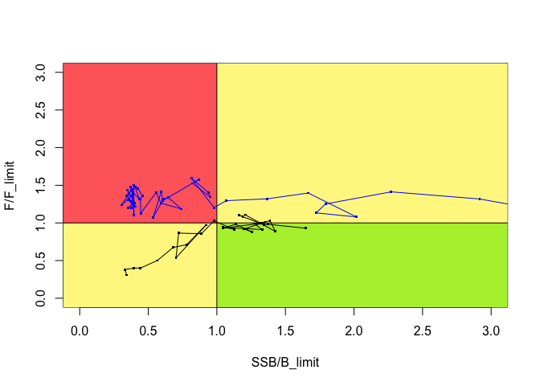

青線が管理を実施する前、黒線が管理を実施した後である。管理を導入した年は、赤い領域（漁業：獲り過ぎ、資源：獲られ過ぎ）からオレンジ色の領域に移る。資源が回復するにつれ、緑色の領域（健全）に移る。
